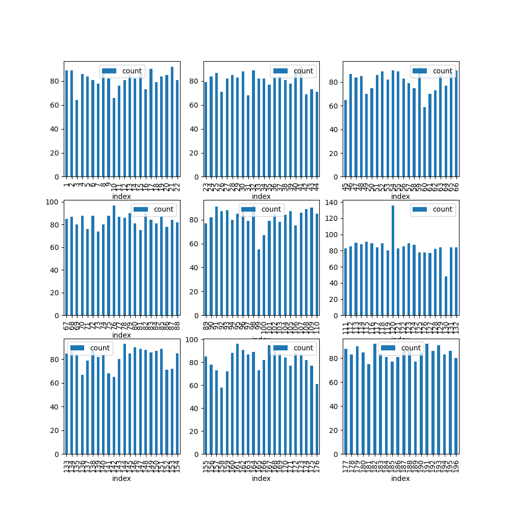
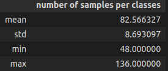
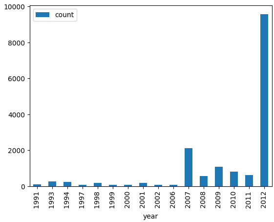
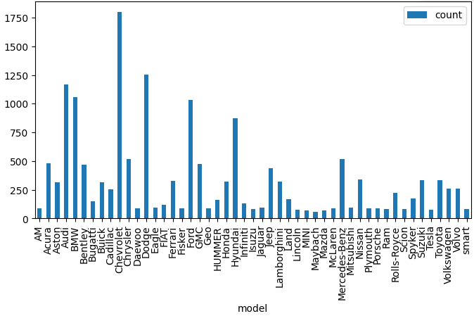
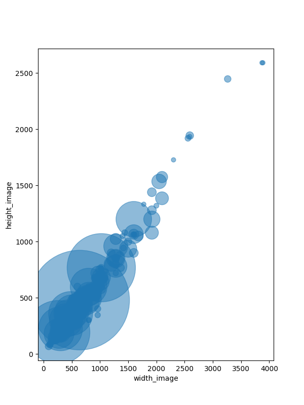
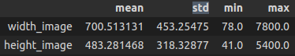
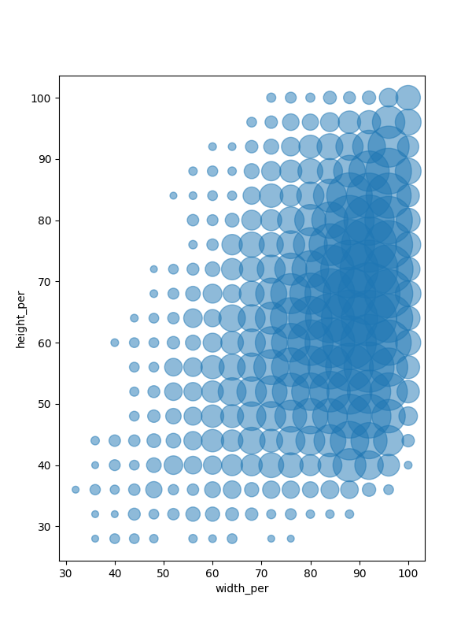
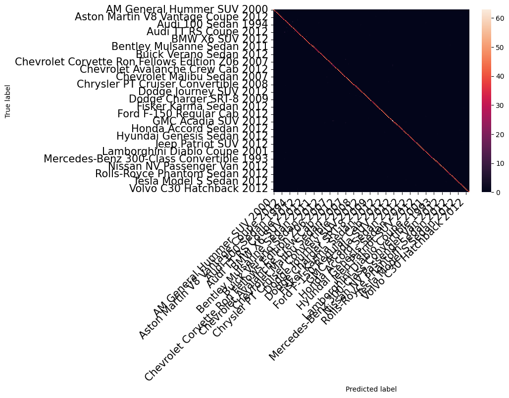
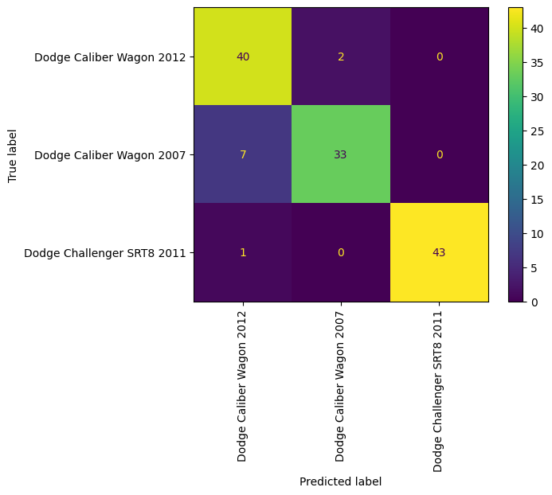

# JOURNAL DE BORD Hackathon 2024 : Challenge 6milarité

## Equipe 4:
- Florine Kieraga (EPITA)
- Eliana Junker (EPITA)
- Martin Natale (EPITA)
- Eithan Nakache (EPITA)
- Sacha Hibon (EPITA)
  
## Lien GitHub
https://github.com/chuklee/army.git 

## Introduction:
Dans ce journal de bord, nous allons expliquer les différentes étapes de notre travail au fil des jours.  

## Jour 1:

### Statistique sur les données

#### Répartition des classes

##### Toutes classes confondues

Conclusion : les donénes sont plutôt bien réparties parmi les classes.

##### Par année

Conclusion : les données des différentes classes ne sont pas réparties équitablement par années.

##### Par marque (premier mot de chaque classe)

Conclusion : les données des classes ne sont pas réparties équitablement par marque.

#### Analyse sur la taille des images

##### Graphe

##### Table

Conclusion : les images sont rectangulaires et sont généralement de tailles 700*483.

#### Analyse sur la taille des voitures comparées aux images

##### Graph

##### Table

### Création du modèle en pytorch
Nous avons fait le choix d'utiliser pytorch pour l'entrainement de notre modèle. Cette bibliothèque à l'avantage d'être très flexible et permet d'importer facilement le modèle resnet18.

#### Première version du modèle
Comme remarqué dans les statistiques des données, le dataset de base est réparti en 50% de train et 50% de test. Les seuls transformations effectuées sont la normalisation et la transformation en tensor. Après avoir demandé à un coach, il nous a été expliqué que pour des images RGB, la normalisation basique est la division par 255. Nous avons décidé d'utiliser cette méthode de normalisation.

##### Hyperparamètres
Pour l'optimizer, nous avons utilisé l'optimizer Adam avec un learning rate de 0.001. et une loss function de type CrossEntropyLoss. Voulant tester rapidement la convergence de notre modèle nous utilisons un batch size de 64 qui privilégie la rapidité d'apprentissage pour délaisser les performances du modèle.

Nous avons constaté que la dernière couche de base de resnet18 possède une sortie prévoyant 1000 classes. Afin que le modèle puisse prédire nos classes, nous avons changé la couche de sortie en une couche de 196 neurones. Nous avons ensuite entrainé le modèle sur 10 epochs.

##### Résultats
Le modèle a atteint une accuracy de 65% sur le test. Nous avons donc décidé de changer les hyperparamètres pour voir si nous pouvions améliorer les performances du modèle.

##### Explication du résultat
Les performances du modèle sont faibles.
Cela peut être dû à plusieurs facteurs :
- Le modèle underfit et n'a pas eu le temps de converger
- Les hyperparamètres ne sont pas adaptés
- Le set de données est trop petit

Nous allons donc essayer de changer les hyperparamètres pour voir si nous pouvons améliorer les performances du modèle.

#### Deuxième version du modèle
##### Hyperparamètres
Afin d'améliorer les performances du modèle, nous avons décidé d'utiliser une méthode de data augmentation sur le jeu de train. Les transformations effectuées sont les suivantes : RandomHorizontalFlip, qui va inverser certaines images et RandomRotation(15) qui va faire une rotation de 15 degrés sur certaines images. Nous ajoutons également un learning rates scheduler de type ReduceLROnPlateau avec un facteur de 0.1 et une patience de 5. Nous avons également décidé d'utiliser un batch size de 32 pour améliorer les performances du modèle. Nous avons ensuite entrainé le modèle sur 10 epochs.

##### Résultats
Le modèle a atteint une accuracy de 98% sur le train et de 88% sur le test. Les performances du modèle ont été grandement améliorées. Nous remarquons néanmoins qu'une divergence commence à apparaitre entre les performances du train et du test, ce qui peut indiquer un overfit du modèle.

### Recherche sur l'explicabilité
Nous avons commencé des recherches sur l'explicabilité afin de comprendre en quoi cela consistait et quelles bibliothèques étaient disponibles.

Lors de ces recherches, nous avons trouvé plusieurs bibliothèques disponibles pour les modèles PyTorch :
  - SHAP (SHapley Additive exPlanations)
  - Captum
  - Torch-Cam qui permet une visualisation avec la génération des cartes d'activations.
  - Lime

Nous avons découvert différentes techniques d'explicabilité :
  - SHAP : basée sur la théorie des jeux, permet de mesurer l’impact sur la prédiction d’ajouter une variable grâce à des permutations de toutes les options possibles.
  - Lime (Local Interpretable Model-agnostic Explanations): explique les prédictions des modèles en ajustant un modèle interprétable local autour de l'instance à expliquer.
  - Occlusion : cette méthode implique la modification de parties de l'image d'entrée pour évaluer l'impact sur la sortie du modèle.
  - Grad-CAM et CAM (Classe Activation Mapping) : génèrent des cartes de chaleur pour visualiser les régions importantes de l'image qui ont contribué à la prédiction de classe du modèle.

Sources:
 - https://medium.com/@mariusvadeika/captum-model-interpretability-for-pytorch-c630fadfc6be 
 - https://github.com/frgfm/torch-cam
 - https://github.com/pytorch/captum 
 - https://indabaxmorocco.github.io/materials/hajji_slides.pdf
 - https://aqsone.com/blog/articlescientifique/interpretabilite-et-explicabilite-des-modeles-de-machine-learning/
 - https://courses.minnalearn.com/en/courses/trustworthy-ai/preview/explainability/types-of-explainable-ai/
 
### Recherche sur les hyperparamètres

Tout au long de la création de nos deux versions de modèle, nous avons décidé de faire les recherches et comparaisons suivantes sur les hyperparamètres :

- Taille de batch : Le batch size représente le nombre d'échantillons qui seront propagés à travers le réseau de neurones. Nous avions décidé d'explorer les batch size suivants : `16`, `32`, `64`, `128`.

- Learning rate : Le learning rate, car il était crucial de déterminer le taux d'apprentissage optimal pour la convergence du modèle. Les valeurs que nous avions décidé d'explorer étaient : `0.0001` et `0.001` .

- Optimizer : Le choix de l'optimizer est crucial pour la convergence du modèle. Il permet de mettre à jour les poids du réseau de neurones. Nous avions décidé d'explorer les optimizers suivants : `Adam`, `SGD`.

- Scheduler : Le scheduler permet de modifier le learning rate au cours de l'entraînement. Nous avions décidé d'explorer les schedulers suivants : `StepLR`, `ReduceLROnPlateau`.

- Poids des classes : Nous avions décidé d'analyser la distribution des classes pour déterminer si nous devions utiliser des poids de classe. Nous avions décidé d'explorer les poids des classes suivants à l'aide de la librairie `sklearn` : `None`, `balanced`.

- Normalisation : La normalisation des données est une étape importante pour l'entraînement du modèle. Nous avions décidé d'explorer les normalisations suivantes : `None`, `ImageNet`, `Z-score`.

- Augmentation des données : Nous avions décidé de mener une recherche sur la data augmentation, car il était important de trouver celle qui permettrait au modèle de converger. Nous avions choisi d'explorer les data augmentations suivantes : `None`, `HorizontalFlip`, `VerticalFlip`, `RandomRotation` , `AutoAugmentation(ImageNet)`.

- Dimension des images : Nous avions décidé de mener une recherche sur l'image shape, car il était important de trouver la bonne forme d'image pour que le modèle converge. Nous avions choisi d'explorer les formes d'image suivantes : `224`, `256`, `416`, `512`.

Sources: 
- https://optuna.readthedocs.io/en/stable/index.html
- https://pytorch.org/docs/stable/optim.html
- https://scikit-learn.org/stable/modules/generated/
- https://pytorch.org/vision/stable/transforms.html
- https://pytorch.org/vision/stable/models.html
- https://pytorch.org/docs/stable/nn.html

### Choix des hyperparamètres

- Taille de Batch : Pour l'instant `32` est conservé car les performances obtenues sont satisfaisantes et permettent un temps d'entraînement acceptable. Ce paramètre sera peut-être changé par la suite avec l'utilisation de optuna.

- Learning rate : En utilisant `0.0001` avec Adam, nous obtenions de meilleurs résultats comparés à `0.001`.

- Optimizer : Nous avons décidé d'employer `Adam` pour nos premiers modèles car il s'agissait du plus récent et de celui avec lequel nous étions les plus familiers. 

- Poids des classes : l'utilisation des poids n'a au final pas été adopté car nous avons remarqué que les classes étaient équilibrées entre elles. Cela entrainait également un problème au niveau de l'entrainement du modèle.

- Normalisation : nous avons utilisé la normalisation `[0.5,0.5,0.5]` à la suite d'une discussion avec un coach.

- Augmentation des données : nous avons conservé `HorizontalFlip`, `RandomRotation` car ils donnent de meilleurs résultats. Cependant, nous n'utiliserons pas `AutoAugmentation(ImageNet)` car celui-ci détruit les performances du modèle en introduisant beaucoup trop de bruit (baisse l'accuracy sur test à 10%).

- Scheduler : nous avons pour l'instant décidé de conserver`ReduceLROnPlateau` qui nous fournit des résultats satisfaisants.

- Dimension des images : Nous avons pour l'instant conservé la taille conseillée par la librairie resnet18 (224*224).

### Conclusion de la journée
Nous avons réussi à entraîner un modèle avec une accuracy de 88% sur le test et nous avons commencé à explorer les différentes méthodes d'explicabilité pour comprendre comment notre modèle prend ses décisions. Nous avons également commencé à explorer les hyperparamètres pour améliorer les performances de notre modèle. Nous sommes globalement satisfaits de notre journée et nous avons hâte de continuer à explorer les différentes méthodes d'explicabilité et d'optimisation de notre modèle.

## Jour 2:

### Troisième version du modèle

#### Modification des hyperparamètres
- Optimizer: nous avons décidé de passer à `SGD` puisque celui-ci obtient de meilleures performances que `Adam` (90% d'accuracy sur le dataset de test pour SGD contre 88% pour Adam avec les mêmes paramètres puis 92% avec des améliorations)
  
- Learning rate : avec le passage à SGD, nous avons changé le learning rate et utilisons à présent `0.01`, ce qui est plus adapté au nouvel optimizer.
  
- Dimensions de l'image : Changer la taille de l'image influence nos résultats et passer à une taille supérieure à `224` (valeur conseillée par la librairie de resnet18) nous permet d'augmenter notre accuracy sur les données de test. Cela peut être justifié par des valeurs plus proches de la taille moyenne des images et donc moins de pertes et de modifications des informations. Après plusieurs tests, le redimensionnement de `512*512` donne les meilleurs résultats.

- Taille du dataset de train/ du dataset de test: nous avons décidé de passer à un ratio `80% / 20%` plutôt que `50% / 50%` pour permettre à notre modèle d'avoir plus de données pour s'entraîner et donc plus de cas différents à voir. Cela nous a permis de passer de 90% d'accuracy à 92% d'accuracy sur le dataset de test.

#### Résultats
Le modèle a atteint une accuracy de 92% sur le test. Les performances du modèle ont été grandement améliorées mais l'étude des résultats permet de constater des pistes d'amélioration supplémentaires.

### Etude des résultats

#### Matrice de confusion

Pour évaluer les performances de notre modèle, la matrice de confusion peut être un très bon outil. En revanche, le dataset étant composé de 196 classes, il est très difficile de l'exploiter. Cela nous permet cependant de visualiser le bon fonctionnement du modèle sur la majorité des classes grâce à la diagonale.

Pour remédier à ce problème, nous l'avons séparé en multiples sous-groupes en groupant les catégories qui étaient les plus confuses entre elles. Cela permet d'obtenir des sous-matrices de taille 5*5 par exemple et de pouvoir se concentrer sur ces 5 classes qui posent problème. Ce zoom nous permet donc de constater que les classes les plus souvent confondues entre elles sont celles avec des modèles de voitures assez semblables entre eux. Cela comprend les voitures d'une même marque ou d'un même modèle mais d'années différentes. On peut citer l'ensemble de la marque Audi qui possède des voitures assez similaires entre modèles et au sein d'un même modèle.

#### Explicabilité
Nous avons pu ensuite utiliser l'explicabilité pour approfondir un peu plus les résultats obtenus par la matrice de confusion. Suite aux recherches réalisées durant le jour 1, nous avons sélectionné deux outils: la librairie Captum pour l'occlusion et la librairie Torch-Cam pour le Grad-Cam.

Nous avons décidé d'utiliser Grad-Cam et non pas Smooth Grad-Cam pour éviter l'impact de la seed présente dans l'utilisation de la deuxième fonction. Cette seed créait bien trop de bruit dans les résultats et impactait donc notre étude de ceux-ci en donnant un résultat parfois totalement différent sur la même image avec le même modèle.

##### Occlusion

Cette librairie nous permet de constater les zones de l'image qui ont permis d'impacter le plus la décision de notre modèle. Nous pouvons ainsi constater que notre modèle ne semble pas être énormément impacté par le paysage ou par ce qui entoure les voitures et se concentre majoritairement sur la silhouette du véhicule pour faire ses choix.

##### GradCam

Gradcam nous permet d'obtenir des informations bien plus intéressantes puisque nous pouvons ainsi voir les zones sur lesquelles se concentre notre modèle pour trouver ses caractéristiques.

Si nous reprenons notre exemple des Audi, c'est ainsi que nous pouvons nous rendre compte que le problème avec ces classes vient de la zone observée : notre modèle se concentre principalement sur l'avant de la voiture lorsque celui-ci est visible et, plus particulièrement, sur le logo de la marque. Or, la plupart des voitures de cette marque possèdent un avant et un logo similaire (celui de la marque). Avec principalement cette caractéristique, il est donc normal d'avoir beaucoup de confusions au sein de ces classes.

### Quatrième version du modèle

#### Amélioration principale

Constater d'où venait le problème pour les classes avec le plus de confusion est intéressant mais ne change pas grand-chose au problème actuel. Nous pouvons cependant utiliser ces nouvelles connaissances pour améliorer notre modèle.

Pour cette quatrième version, nous allons commencer par ajouter quelques images supplémentaires dans notre base de données d'entraînement.

Pour réaliser cette étape, nous allons réutiliser les données obtenues à l'aide de GradCam: la zone désignée comme la plus regardée par le modèle va être floutée pour environ 50% de nos données et ainsi forcer le modèle à trouver de nouvelles caractéristiques distinctes parmi ces classes.

Le modèle principal est ensuite réentrainé avec les nouvelles données.

#### Autre amélioration réalisée

Les modifications vues précédemment ne sont pas toujours suffisantes. Certaines des classes possèdent des images de véhicules très similaires et avec très peu de différences. Par conséquent, nous avons décidé d'entrainer notre modèle mais spécifiquement sur ces cas pour lui permettre de se concentrer sur la moindre distinction possible.

Les hyperparamètres du modèle sont similaires mais les données ne sont à présent plus globales mais spécifique aux classes que nous souhaitons étudier.

Ce modèle spécifique peut se révéler très utile dans le cas où nous ne devrions pas étudier des objets différents mais bien un seul type d'objet avec des sous-catégories.

Dans notre cas, nous ne voulons plus reconnaître un modèle de voiture parmi tous mais un modèle spécifique d'Audi parmi les classes Audi disponibles. Nous obtenons ainsi beaucoup moins de confusion au sein de cette marque avec ce nouveau modèle spécifique.

### Conclusion de la journée

Nous avons pu étudier et comparé différentes instances de notre modèle pour trouver des combinaisons d'hyperparamètres nous convenant. Ainsi, nous avons réussi à entraîner un modèle avec une accuracy de 92% sur le test.

L'étude des résultats avec l'explicabilité nous a également permis de comprendre les différentes failles de notre modèle et donc de l'améliorer et de trouver d'autres possibles améliorations à mettre en place ou à expliquer.